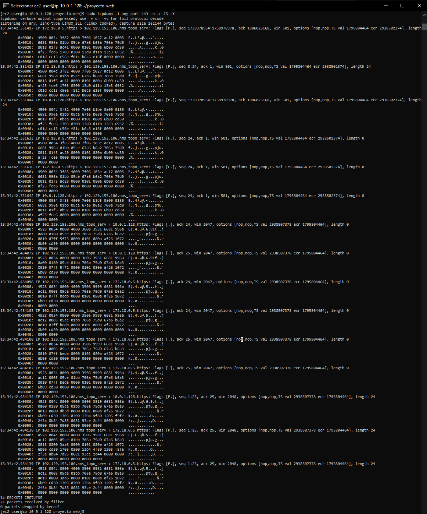
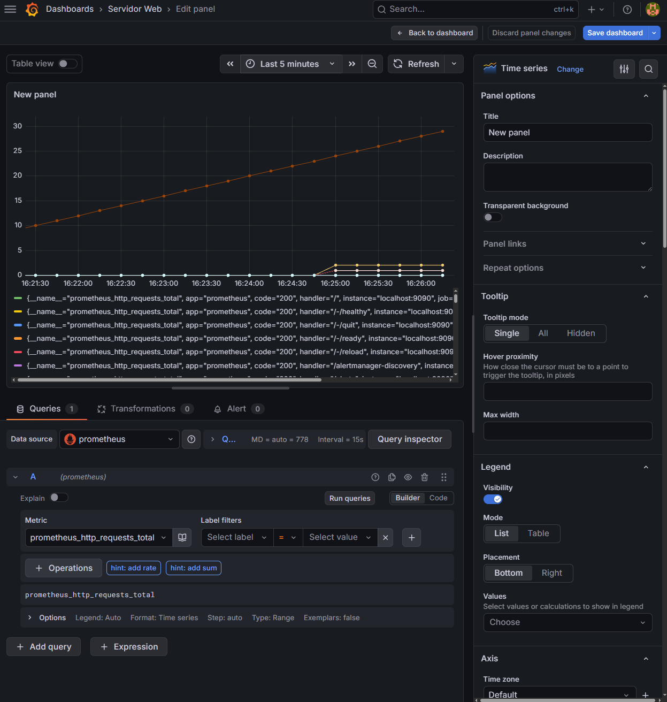

# Proyecto de Servicios en Red - Infraestructura Web Segura

En este repositorio se encuentran los archivos de configuración de mi proyecto final. El objetivo de la práctica ha sido desplegar una infraestructura de servicios web segura y monitorizada utilizando la nube de AWS y contenedores Docker.

## 1. Topología base (Terraform y AWS)
Toda la infraestructura en Amazon Web Services la he levantado utilizando Terraform. He configurado dos VPCs conectadas mediante peering para separar los servicios:
* **Subred pública:** Aquí está la máquina principal que tiene salida a internet. Aloja el proxy y los servidores web.
* **Subred privada:** Está totalmente aislada de internet. Aquí he metido el servidor LDAP por motivos de seguridad, para que nadie desde fuera pueda atacarlo directamente.

## 2. Dominio y Seguridad (HTTPS)
Para no tener que acceder a través de una dirección IP, he usado DuckDNS para configurar el dominio dinámico `imad-proyecto-redes.duckdns.org`.

Además, era obligatorio no usar certificados autofirmados, así que he generado e instalado certificados reales de Let's Encrypt. De esta forma, todo el tráfico de la web va por el puerto 443 (HTTPS) y aparece el candado verde en el navegador. 

Para demostrar que la conexión es segura y no se pueden robar las contraseñas, en el vídeo realizo un snifado de red con `tcpdump` donde se ve que las cabeceras y el tráfico están totalmente cifrados.

## 3. Servidores Web y Sitios Virtuales
En lugar de instalar los servicios a mano, he usado `docker-compose` para levantar los contenedores. Como servidor principal he elegido Apache, ya que sus módulos me permiten configurarlo fácilmente como Proxy Inverso.

He creado varios sitios virtuales bajo el mismo dominio. Apache hace de "puerta de entrada" y redirige el tráfico dependiendo de la ruta que pongas en el navegador:
* Si entras a `/php`, te manda al contenedor que procesa código PHP.
* Si entras a `/tomcat`, te manda al contenedor con el entorno Java.
* El diseño de las webs es muy simple (muestran la hora y la versión) porque me he centrado en que el enrutamiento de la infraestructura funcione perfectamente, más que en la decoración.

## 4. Autenticación y Control de Acceso (LDAP)
He protegido la ruta `/privado` del servidor. Cuando intentas entrar, Apache te frena y te pide un usuario y una contraseña.

Para validar esas credenciales, Apache se comunica por la red interna con el contenedor de OpenLDAP que tenemos en la máquina de la subred privada. Si pones un usuario que existe en la base de datos (por ejemplo, "susana"), el servidor te da acceso.

## 5. Monitorización del Servicio
Para comprobar que los contenedores están funcionando y no se han caído, he integrado Prometheus y Grafana.
Prometheus va recogiendo los datos de los contenedores por detrás, y Grafana nos los muestra en un panel visual. He configurado gráficos donde se puede ver en tiempo real cómo suben las peticiones de red cuando interactuamos con el servidor.

---

## Vídeo Demostrativo
En el siguiente enlace dejo el vídeo donde explico paso a paso el funcionamiento de todo este montaje, probando todas las casuísticas que se pedían en la práctica:

**[[PONER AQUÍ EL ENLACE AL VÍDEO](https://drive.google.com/file/d/1pg5p7hHuqL6YbKSF11ewI2rsxrvGCFjw/view?usp=sharing)]**

## Vídeo respondiendo a las preguntas del criterio a
En el primer video se me ha olvidado contestar las pregundas del criterio a, asi que te adjunto otro cortito respondiendo a las preguntas:
**[[PONER AQUÍ EL ENLACE AL VÍDEO](https://drive.google.com/file/d/12hV3QgfQ4Hq_wwpJJAssn_ETvhA7z5g-/view?usp=sharing)]**

